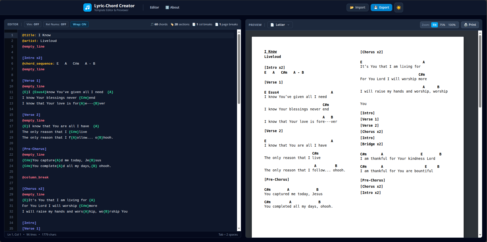
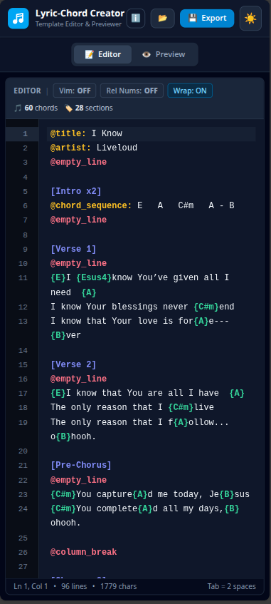
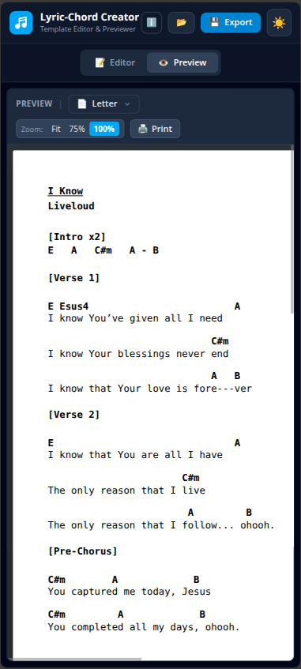

# Lyric-Chord Creator

**Lyric-Chord Creator** is a modern, lightweight, and offline-capable web utility built with **SolidJS 2.x** for creating, editing, and printing multi-column lyric-chord sheets.

It uses a clean, intuitive plaintext template syntax that automatically formats lyrics and chord placements into responsive, print-ready pages that fit standard paper sizes without breaking chord-to-lyric alignment.

<p align="center">
  
</p>

<p align="center">
  
  
</p>

---

## ✨ Features

- **Intuitive Template Syntax**: Place chords directly in line with lyrics (e.g. `{G}`, `{C/E}`, `{Am7}`) or write stand-alone chord sequences (`@chord_sequence: G - D - Em - C`).
- **Automatic Alignment & Column Balancing**: Formatted into an auto-flowing 2-column layout designed to fit standard physical sheets with minimal manual adjustments.
- **Multiple Songs per Template**: Author entire setlists or multi-song songbooks in a single document using `@page_break` and individual `@title:` and `@artist:` headers.
- **Live Scaled Preview**:
  - Real-time rendering as you type.
  - Zoom controls: **Fit to Screen**, **75%**, and **100%**.
  - Paper size selector: **Letter**, **A4**, **Legal**, and custom dimensions.
- **Advanced CodeMirror 6 Editor**:
  - **Vim Mode**: Full modal editing (Normal, Insert, Visual, Replace, and Command modes) powered by `@replit/codemirror-vim`.
  - **Toggleable Relative Line Numbers**: Hybrid numbering display (absolute line number on current line, relative distance on surrounding lines) with `:set rnu` / `:set nornu` support.
  - **Real-Time Syntax Highlighting**: Color-coded tokens for directives, sections, chords, and lyrics.
  - **Soft Word Wrapping**: Toggleable wrap mode with persistent preferences.
  - **Drag & Drop File Support**: Drop `*.lcct.txt`, `*.scgt.txt`, or `*.txt` files directly into the editor.
- **Print & PDF Export**: One-click printing via isolated print iframe with clean print styles.
- **Dark & Light Modes**: Seamless theme switching with persistent local storage.
- **PWA & Offline Capable**: Fully functional offline via service worker and Web App Manifest.

---

## 📝 Syntax Reference

### Document & Song Metadata
```txt
@title: Amazing Grace
@artist: John Newton
```

### Layout Controls
- `@column_break`: Forces content following this tag to break into the next column.
- `@page_break`: Forces a page break to begin a new physical page (ideal for multiple songs).
- `@empty_line`: Inserts a blank vertical spacing line in the column.

### Section Labels
Wrap section headings in square brackets:
```txt
[Intro]
[Verse 1]
[Chorus]
[Bridge]
[Outro]
```

### In-Line Chords
Embed chords inside curly braces right above the intended word or syllable:
```txt
A{G}mazing grace, how {C}sweet the {G}sound
That saved a {D/F#}wretch like {G}me
```

### Standalone Chord Sequences
Annotate instrumental intros, interludes, or progressions:
```txt
@chord_sequence: G - Em - C - D
```

---

## 🎹 Vim Mode & Keybindings

Toggle Vim Mode directly via the **`Vim: ON / OFF`** button in the editor toolbar or persist your preferred workflow:

- **Mode Switching**:
  - `i`, `I`, `a`, `A`, `o`, `O` &rarr; Enter **Insert** mode
  - `v` / `V` &rarr; Enter **Visual** / **Visual Line** mode
  - `R` &rarr; Enter **Replace** mode
  - `Esc` or `Ctrl+[` &rarr; Return to **Normal** mode
- **Relative Line Numbers**:
  - Toggle via toolbar button or Ex commands: `:set rnu` / `:set nornu`
- **Motions & Operators**:
  - `h`, `j`, `k`, `l`, `w`, `b`, `e`, `0`, `$`, `^`, `gg`, `G`
  - Counts: `5j`, `10k`, `3dd`, `d5j`, `ciw`
  - `yy` (yank line), `p` / `P` (paste), `u` (undo), `Ctrl+r` (redo)
  - `/search` and `?search` with `n` / `N` navigation

---

## 🛠️ Tech Stack

- **Framework**: [SolidJS 2.x](https://solidjs.com) (fine-grained reactive signals and JSX)
- **Editor**: [CodeMirror 6](https://codemirror.net/) with [@replit/codemirror-vim](https://github.com/replit/codemirror-vim)
- **Styling**: [UnoCSS](https://unocss.dev) with `@unocss/preset-wind4`
- **Build Tool**: [Vite](https://vitejs.dev)
- **PWA**: [vite-plugin-pwa](https://vite-pwa-org.netlify.app/)
- **Linter & Test**: [oxlint](https://oxc.rs) & [Vitest](https://vitest.dev)

---

## 🚀 Getting Started

### Development

#### Prerequisites
- Node.js (>= 18)
- [pnpm](https://pnpm.io) (recommended) or npm / yarn

#### Project Setup
```bash
git clone https://github.com/jdelacruz/lyric-chord-creator.git
cd lyric-chord-creator
pnpm install
```

#### Running the App in dev mode
```bash
pnpm dev
```
Open [http://localhost:3000/apps/lyric-chord-creator](http://localhost:3000/apps/lyric-chord-creator) in your browser.

### Build & Production
```bash
pnpm build
pnpm serve
```
The static production assets will be generated in `dist/client`.

### Linting
```bash
pnpm lint
```

---

## 🤖 LLM Use Disclosure

While I developed the template syntax, processor, and CSS-based chord anchoring mechanism entirely on my own, the web app implementation was built primarily with AI assistance (`Antigravity CLI` with `Gemini 7.3`), with manual guidance and customizations. This document was also generated with LLM assistance.

(Yeah, I know, it isn't all that difficult to come up with the template syntax thing and the CSS-based chord anchoring mechanism.)

The original project where the template syntax and processor were developed:

- [printable-song-chord-guide](https://github.com/john-dc252/printable-song-chord-guide)

Some revisions and additional syntax:

- [my static webapps project](https://github.com/john-dc252/john-dc252.github.io) (Contains other stuff. Look for "song chords utility" in the commit history. I got tired of copying and pasting from the original project, so I just continued here)

---

## 📄 License

MIT
